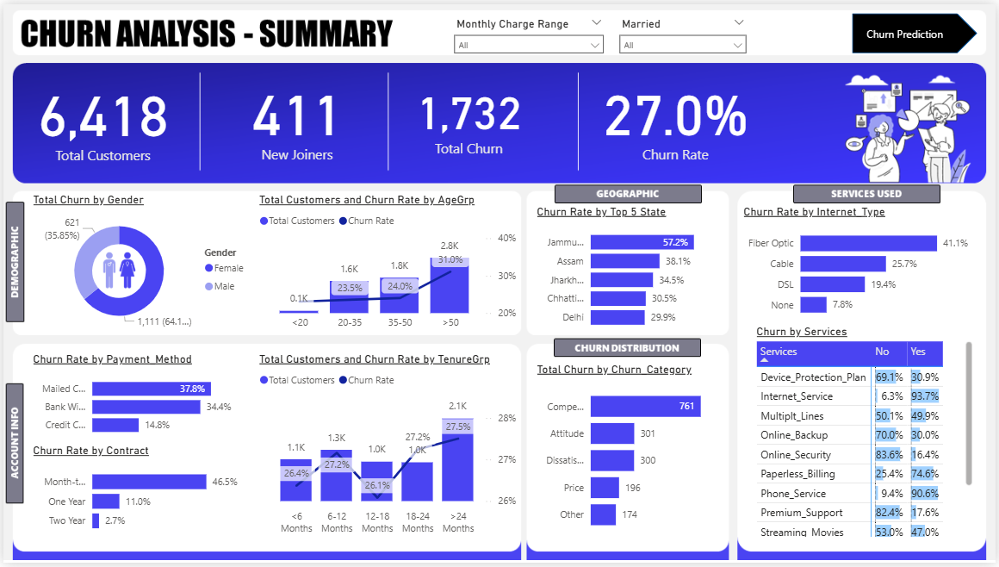
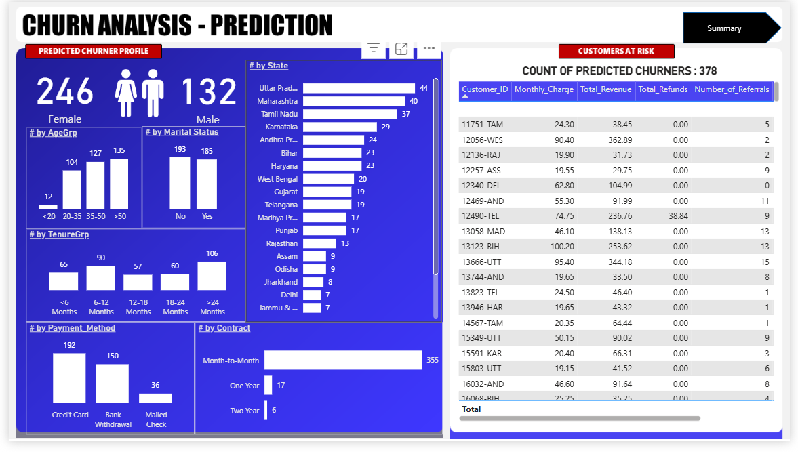
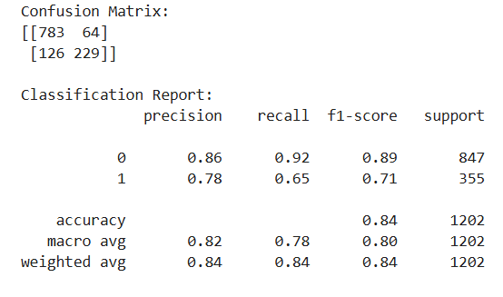
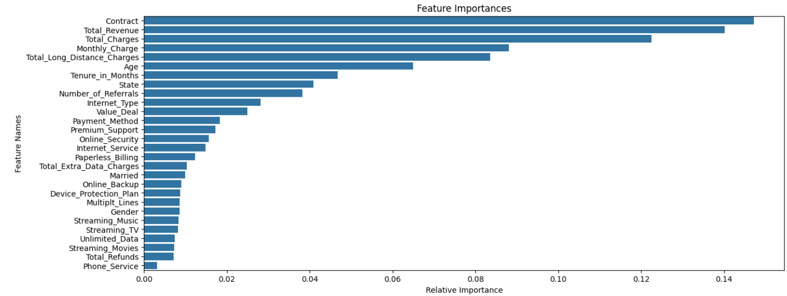

# Telecom Customer Churn Analysis 📊
## 📌 Project Overview
- This project is an end-to-end churn analysis of a telecom dataset.
- The main objective is to identify customers who are likely to churn and understand the factors influencing their decision.
- The analysis combines SQL, Python (Machine Learning), and Power BI to deliver actionable insights and predictive modeling.

## 🗂️ Dataset
- Source: Telecom Customer Churn dataset (commonly used for churn prediction projects).
- Rows: ~7,000 customers
- Columns: Customer demographics, account information, service subscriptions, and churn flag.

## Key Features:

- gender, SeniorCitizen, Partner, Dependents
- tenure, MonthlyCharges, TotalCharges
- Contract, PaymentMethod, InternetService
- Churn (target variable)

## 🔑 Steps Performed
1. Data Collection & Exploration:
    - Imported dataset and checked for missing/invalid values
    - Performed Exploratory Data Analysis (EDA): distributions, churn rate, correlations
2. Data Preprocessing:
    - Converted categorical features using one-hot encoding
    - Handled missing values and outliers
    - Scaled numerical features where required
    - Balanced dataset using SMOTE
4. SQL Analysis:
    - Queried customer retention patterns using SQL
    - Derived aggregates (e.g., churn by contract type, churn by payment method)
5. Machine Learning:
    - Models Tried: Logistic Regression, Random Forest, XGBoost
    - Metrics Used: Accuracy, Precision, Recall, F1-score, ROC-AUC
    - Identified important features driving churn
6. Dashboard (Power BI):
    - Built an interactive dashboard to visualize churn trends:
        - Churn rate by demographics
        - Churn by contract/payment type
        - Revenue impact of churn

## 📈 Results

- Achieved ROC-AUC ~0.84 with XGBoost
- Top churn indicators:
  - Short tenure
  - Month-to-month contract
  - Higher monthly charges
  - Electronic check payment method

## 🚀 How to Run
### 🔧 Prerequisites
1. Python 3.8+
2. Jupyter Notebook / VSCode
3. SQL (MySQL/PostgreSQL/SQLite)
4. Power BI (for dashboard visualization)

## 📊 Dashboard Preview

- Dashboard Images

- Confusion Matrix

- Features Importance Histogram

## 📚 Tech Stack

- Python: Pandas, NumPy, Scikit-learn, XGBoost, Matplotlib, Seaborn
- SQL: Data querying & preprocessing
- Power BI: Dashboard & visualization
- Jupyter Notebook: ML experimentation

## 🙌 Acknowledgements

  - Dataset & project idea inspired by Pivotalstats YouTube Channel
  - Open-source community for libraries and tools

✨ If you like this project, consider giving the repo a star ⭐!
